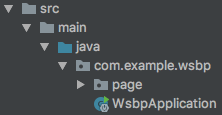
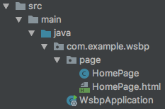

# WebPageを表示する 01

まずはHTMLを表示する。

## 事前準備

src > main > java フォルダの中に、`com.example.wsbp` パッケージがある。

この中に `page` パッケージを作成する。以下はこのパッケージで作業する。



## ベースとなるHTMLを作成

`page` パッケージの中に、HomePage.html を作成する。


```html
<html xmlns:wicket="http://wicket.apache.org">
<head></head>
<body>
<p>Hello, you!</p>
</body>
</html>
```

- `xmlns:wicket=...` は、HTMLの中にwicket用の特別なタグや要素を書くことを、IntellIJなどの開発ツールに認識させる。

## HTMLを書き換えるためのJavaクラスを作成

HomePage.htmlを書き換えるための HomePage.java を、同じ `page` パッケージの中に作成する。



import するクラスを間違えないように注意！

```java
package com.example.wsbp.page;

import com.giffing.wicket.spring.boot.context.scan.WicketHomePage;
import org.apache.wicket.markup.html.WebPage;
import org.wicketstuff.annotation.mount.MountPath;

@WicketHomePage
@MountPath("Home")
public class HomePage extends WebPage {

  public HomePage() {
    
  }

}
```

- `@WicketHomePage` は、Wicket-Spring-Bootが表示する最初のページに設定する
- `@MountPath("Home")` は、HomePageクラスとそのHTMLを `http://.../Home` というURLでアクセスできるよう、URLのファイルパス部を設定する
- Wicketが提供する `WebPage` クラスを継承することで、同じ名前のHTMLファイルを書き換える能力をもつ

## ここまでの動作確認

WSBPApplciation を起動する。

Webブラウザで [http://localhost:8080/](http://localhost:8080/) にアクセスし、以下の2つを確認する。

- ブラウザに `Hello, you!`と表示されている
- URLが `http://localhost:8080/Home` に変更（最初のページとして転送）されている

----

[目次へ](../../README.md)