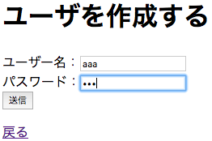
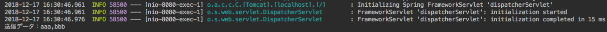

# ユーザ追加フォームを作成する 02

フォームの入力欄のデータ管理と、データ送信後の処理を作成する

## コンポーネントのモデルを作成

UserMakerPage に配置したコンポーネントのために、モデルを用意する。

UserMakerPage に、利用するモデルクラスを import する。

```java
import org.apache.wicket.model.IModel;
import org.apache.wicket.model.Model;
```

モデルをインスタンス化して、それぞれのコンポーネント用に設定する

```java
  public UserMakerPage() {
    var userNameModel = Model.of("");
    var userPassModel = Model.of("");
    
    // これまでに作成した部分を中略
    
    var userNameField = new TextField<>("userName", userNameModel);
    userInfoForm.add(userNameField);
    
    var userPassField = new PasswordTextField("userPass", userPassModel);
    userInfoForm.add(userPassField);
  }
```

これで、 userNameField のデータは userNameModel で、 userPassField のデータは userPassModel で管理するようになる。

## データ送信時の処理を作成

データ送信時（つまり、フォームの送信ボタンが押されたとき）の処理は、Formコンポーネントに設定する。

Form コンポーネントを継承して、送信時の処理を自分の好きなように変更したFormサブクラスを作ればよい。

Wicketでは **匿名クラス**(無名クラスともいう) という特殊なクラス継承の方法をよく使う。

```java
// たとえば、ClassAの匿名クラスを作ってインスタンス化するときは、
// ClassAをインスタンス化するように書き、最後に {} をひらく
ClassA classA = new ClassA() {
  
  // この中は、ClassAを継承したサブクラス部分のコードとして扱われる
  // このサブクラスにはクラス名がないので「匿名（無名）」クラスと呼ばれる
  
};
```

### Formコンポーネントを匿名クラス化して継承する


UserMakerPage に配置したFormコンポーネントの部分を匿名クラス化する。

```java
//配置したFormコンポーネントを匿名クラス化して処理を上書きする
var userInfoForm = new Form<>("userInfo") {
  @Override
  protected void onSubmit() {
    var userName = userNameModel.getObject();
	var userPass = userPassModel.getObject();
	var msg = "送信データ："
        + userName
        + ","
        + userPass;
    System.out.println(msg);
  }
};
add(userInfoForm);
```

- Formコンポーネントは送信ボタンが押されると、 `onSubmit(){...}` を実行する仕組みになっている。<br>ただのFormクラスでは、この onSubmit メソッドに何も処理が書かれていない。<br>匿名クラスでこれをオーバーライドして、処理を書き換えている。
- 匿名クラス化するときには、左辺 `new Form<>(...)` の型引数を省略していることに注意。（省略しない場合はModelの型引数。Modelがない場合は `Void`）
- Modelインスタンスの `getObject()` メソッドを使うと、Modelで管理しているデータの中身を取り出せる。
- ここでは、 userNameField, userPassField 用に用意したモデルの中身を標準出力に表示している。送信ボタンが押されると以下の様に処理が実行される。
    1. ブラウザからフォームの入力値がサーバへ送信される
    1. サーバの Wicket が情報をうけとり、 userNameField, userPassField のコンポーネントを通じて、それぞれのモデルにフォームの入力値が入る
    1. userInfoForm の匿名クラスで `onSubmit(){...}` が実行されて、それぞれのモデルの中に入った値が標準出力に表示される

## ここまでの動作確認

WSBPApplciation を再起動する。

Webブラウザで [http://localhost:8080/](http://localhost:8080/) にアクセスし、 ユーザを新規追加 リンクを押すと、 UserMakerPage が表示される。

ユーザー名、パスワードの欄に何か文字列を入力して、送信ボタンを押すと、IntelliJの標準出力に表示される。



たとえば、`aaa` , `bbb` と入力し、送信ボタンを押すと、



標準出力に `送信データ：aaa, bbb` と表示される。

これにより、送信ボタンを押すと、ブラウザからの入力データがWicket側（コンポーネントのモデル）に反映されていることがわかる。

----

[目次へ](../../README.md) 

