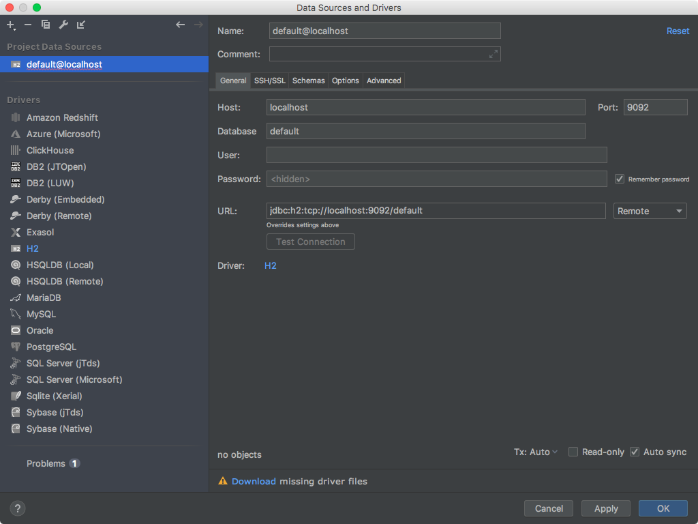
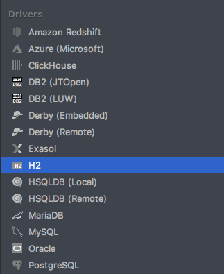
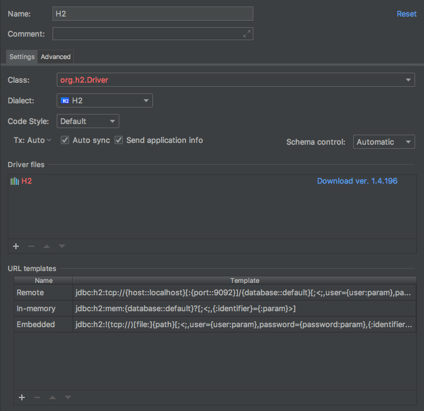
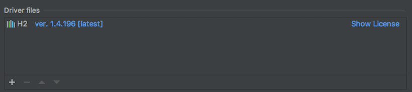
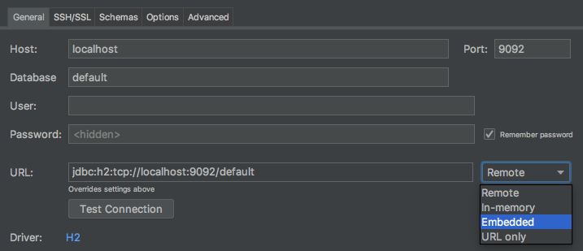
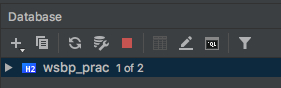
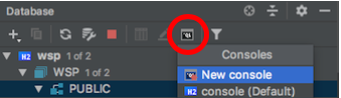
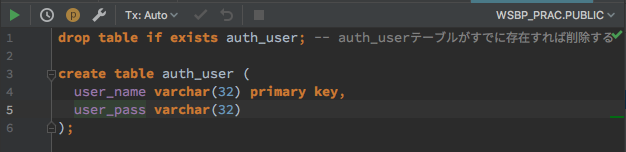
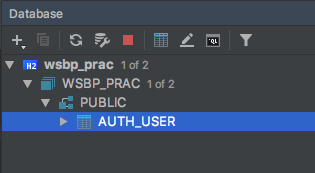

# データベースとテーブルの準備

ユーザ追加フォームに入力した情報を記録できるデータベースとテーブルを準備する

## データベースを作成する

今回は、H2DBという小規模（組み込み）用のリレーショナルデータベースを使う。まず、IntelliJ IDEAにH2DBを設定し、データベースを作成する。

### IntelliJ IDEA への設定

IntelliJの左側のメニューから データベース（database）タブを開く。<br>表示されるメニューの中から「＋」ボタンを押し、 データソース（Data Source） ＞ H2 を選ぶ。


IntelliJ IDEAからアクセスするデータベースのダイアログが表示される。



ドライバー（Drivers） の欄から H2 を選ぶ。



H2のドライバ設定画面になる。ドライバとはDBをプログラムから操作するために必要な機能（ライブラリ）のことである。



画面真ん中の ドライバー・ファイル（Driver files） の欄の `Download ver. x.x…` のリンクをクリックすると、ドライバがダウンロードされる。

ドライバー・ファイル（Driver files） の欄の「H2」が白字になり、右側にバージョン番号 `ver. x.x... [latest]` のように表示されればOK。



プロジェクト・データ・ソース（Project Data Sources） の `default@localhost` を選んで、画面を戻す。


まず、「URL」欄の右にあるプルダウンボタンを「Embedded」に切り替える。



入力項目が切り替わるので、下の内容を入力する。

- **名前（name）**： `wsbp_prac`
- **コメント（comment）**：`講習会`
- **パス（Path）**： `~/h2db/wsbp_prac;Mode=PostgreSQL;AUTO_SERVER=TRUE;`
  - ~ （チルダ） は日本語キーボードの場合、shift＋「へ」で入力
- **ユーザ（User）**：あなたの学籍番号（`bxxxxxxx`）や忘れにくいユーザ名
- **パスワード（Password）**： あなたの学籍番号（`bxxxxxxx`）や忘れにくいパスワード

※URLの項は自動で入力される

!Data Sources and Drivers](./fig01g.png)

ここまで出来たら、**接続のテスト（Test Connection） ボタンを押し**て、 **<span style="color:green">成功（Successful）</span> **と表示されることを確認する。


OKボタンを押して、上記で設定したデータベースのパスワードを入力すると、IntelliJのデータベース欄に `wsbp_prac` が追加される。



また、これにより自分のホームフォルダに **h2db** というフォルダが追加される。このフォルダの中に、データベースの実ファイルが保存されている。

## ユーザー情報を記録するテーブルを作成する

リレーショナルデータベースでは、あるデータを「属性の集合」であらわす。（これは、クラスのフィールドと考え方が似ている）。

属性の集合は テーブル という表にすると考えやすい。

ここでは、ユーザ情報を記録する auth_user 表を作成する。

### テーブルの作成

IntelliJのデータベース欄で、赤丸部分のアイコンを選択し、New Console を選ぶ。



表示されたウィンドウに、SQLというデータベースへの命令コマンドを打ち込む。



```sql
drop table if exists auth_user; -- auth_userテーブルがすでに存在すれば削除する

create table auth_user (
  user_name varchar(32) primary key,
  user_pass varchar(32)
);
```

実行したいSQLを選択状態にして、 右クリック ＞ 実行する でデータベースにSQLを反映する。

### 作成したテーブルの確認

IntelliJのデータベース欄のツリーを拓いていくと、 auth_user という項目ができている。



#### オススメ設定

実行するSQLを毎回選択状態にするのが面倒な場合は、IntelliJの ファイル＞設定＞ツール＞データベース＞コンソールで実行 の「When inside statement execute」や「そうでない場合の実行」を「Whole Script」に設定すると、コンソール上に書かれたSQLが全て実行されるようになる。

----

[目次へ](../../README.md) 
