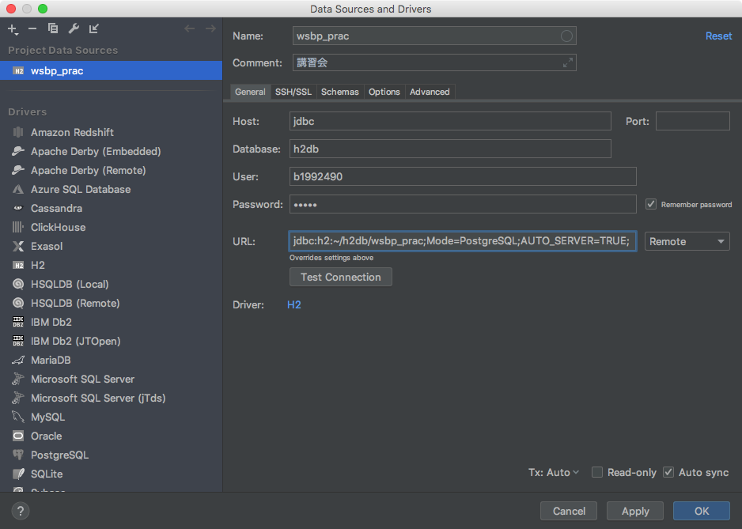

# データベースにユーザ情報を記録する 01

ユーザ追加フォームに入力した情報を、実際にデータベースに記録する

## データベースを作成する

今回は、H2DBという小規模（組み込み）用のデータベースを使う。まず、IntelliJ IDEAにH2DBを設定し、データベースを作成する。

### IntelliJ IDEA への設定

IntelliJの左側のメニューから データベース（database）タブを開く。 表示されるメニューの中から「＋」ボタンを押し、 データソース（Data Source） ＞ H2 を選ぶ。

IntelliJ IDEAからアクセスするデータベースのダイアログが表示される。

ドライバー（Drivers） の欄から H2 を選ぶ。

H2のドライバ設定画面になる。ドライバとはDBをプログラムから操作するために必要な機能（ライブラリ）のことである。

画面真ん中の ドライバー・ファイル（Driver files） の欄の `Download ver. x.x…` のリンクをクリックすると、ドライバがダウンロードされる。

ドライバー・ファイル（Driver files） の欄の「H2」が白字になり、右側にバージョン番号 `ver. x.x... [latest]` のように表示されればOK。

プロジェクト・データ・ソース（Project Data Sources） の `default@localhost` を選んで、画面を戻す。

まず、「URL」欄の右にあるプルダウンボタンを「Embedded」に切り替える。

入力項目が切り替わるので、下の内容を入力する。

- **名前（name）**： `wsbp_prac`
- **コメント（comment）**：`講習会`
- **パス（Path）**： `~/h2db/wsbp_prac;Mode=PostgreSQL`
  - ~ （チルダ） は日本語キーボードの場合、shift＋「へ」で入力
- **ユーザ（User）**：あなたの学籍番号（`bxxxxxxx`）や忘れにくいユーザ名
- **パスワード（Password）**： あなたの学籍番号（`bxxxxxxx`）や忘れにくいパスワード

※URLの項は自動で入力される

ここまで出来たら、**接続のテスト（Test Connection） ボタンを押し**て、 **成功（Successful） **と表示されることを確認する。

OKボタンを押して、上記で設定したデータベースのパスワードを入力すると、IntelliJのデータベース欄に `wsbp_prac` が追加される。

## h2データベースの場所を設定する

----

[目次へ](../../README.md) | [次へ](./02.md)
