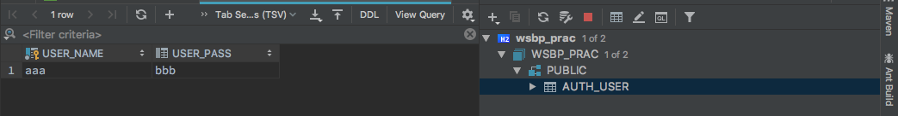

# テーブルにユーザ情報を記録する

auth_user テーブルに、Wicketから入力した ユーザー名, パスワードを記録する。

以前、画面に表示するデータの生成を Spring で行ったように、入力値のデータベースへの記録は Spring に担当させる。

## データベースに接続するための設定を行う

Springのプログラム上から、データベースに接続するための設定を src > main > resources フォルダの  application.properties ファイルに追記する。

```properties
## これまでの記述内容を中略

### Springの設定
## JDBCの設定
spring.datasource.driver-class-name=org.h2.Driver
spring.datasource.url=jdbc:h2:~/h2db/wsbp_prac;Mode=PostgreSQL;AUTO_SERVER=TRUE;
spring.datasource.username=先ほど設定したデータベースのユーザー名
spring.datasource.password=先ほど設定したデータベースのパスワード
```

## Spring からデータベースを利用する

データベースなどの、アプリケーション外のデータ元（データ・ソース）を使うときに、Springでは Repository というクラスを作成する。

また、 Spring では様々なデータベース利用機能が提供されているが、ここでは最も基本的な Spring JDBC を利用する。

### パッケージの準備

`com.example.wsbp.repository` パッケージを作成する。以下はこのパッケージで作業する。

### Repositoryのインターフェースと実装クラスを作成する

#### IAuthUserRepository インターフェース

`com.example.wsbp.repository` パッケージに、   IAuthUserRepository インターフェースを作成する。

```java
package com.example.wsbp.repository;

public interface IAuthUserRepository {

   /**
   * ユーザー名とパスワードをAuthUserテーブルに記録する
   *
   * @param userName ユーザー名
   * @param userPass パスワード
   * @return データベースの更新行数
   */
  public int insert(String userName, String userPass);

}
```

#### AuthUserRepository クラス

IAuthUserRepository の実装クラスとして、AuthUserRepository を作成する。この実装クラスはSpringの中で Repository 用のクラスとして管理し、Spring JDBCを利用するように設定する。

```java
package com.example.wsbp.repository;

import org.springframework.beans.factory.annotation.Autowired;
import org.springframework.jdbc.core.JdbcTemplate;
import org.springframework.stereotype.Repository;

@Repository
public class AuthUserRepository implements IAuthUserRepository {

  // SpringJDBCのデータベース制御用インスタンス
  private final JdbcTemplate jdbc;

  // jdbc の di/ioc 設定（Wicketとやり方が異なるので注意）
  @Autowired
  public AuthUserRepository(JdbcTemplate jdbc) {
    this.jdbc = jdbc;
  }

  @Override
  public int insert(String userName, String userPass) {
    var sql = "insert into auth_user values (?, ?)";
    var n = jdbc.update(sql, userName, userPass);
    return n;
  }

}
```

- JDBCTemplate は、Spring JDBC が用意するデータベース制御用の型。データベースを操作する様々な機能がメソッドとして提供される。
- `@Autowiread` がついたコンストラクタは、 `jdbc` をIoC/DIする。WicketのWebPageにSpringのインスタンスを IoC/DI するときと、今回のように Spring から Spring のインスタンスをIoC/DIするときで、書き方が変わるので注意すること。
- sql は、先ほど作成した auth_user テーブルに ? と ? の2つのデータを入れることを指示するコマンド。
- `jdbc.update...` で、sql を実行するときに、最初の ? を userName 引数の値に、次の ? を userPass 引数の値に置換して実行している。

### Repository を呼びだす Service を作成する

`com.example.wsbp.service` パッケージに、  Repository を呼び出す 新しい Service を準備する。パッケージの切替に注意！

#### IUserService インターフェース

ユーザに関する機能を提供する IUserService インターフェースを作成する。

```java
package com.example.wsbp.service;

public interface IUserService {

  public void registerUser(String userName, String userPass);

}
```

#### UserService クラス

IUserService の実装クラスとして、UserRepository を作成する。この実装クラスは、Repository をIoC/DIして、データベースを使いながら、ユーザに関わる機能（サービス）をWicketに提供する。

```java
package com.example.wsbp.service;

import com.example.wsbp.repository.IAuthUserRepository;
import org.springframework.beans.factory.annotation.Autowired;
import org.springframework.stereotype.Service;

@Service
public class UserService implements IUserService {

  private IAuthUserRepository authUserRepos;

  @Autowired
  public UserService(IAuthUserRepository authUserRepos) {
    this.authUserRepos = authUserRepos;
  }

  @Override
  public void registerUser(String userName, String userPass) {
    int n = authUserRepos.insert(userName, userPass);
    System.out.println("記録行数：" + n);
  }

}
```

- `@Autowiread` がついたコンストラクタは、 `authUserRepos` をIoC/DIする。先ほどと同じように、 Spring から Spring のインスタンスをIoC/DIするときの書き方。
- この実装クラスはたいした働きをしていないように思えるが、**データベースにアクセスするRepository** と、**データベースのアクセスを使って何かの機能を提供するService** として、別々の役割を割り当てている。
    - Repository は、決まったテーブルにしかアクセスさせない。
    - Service は、いろんなRepositoryを使って、Wicketに機能を提供する
- こういった考え方は、 ファサードパターン という設計手法にも繋がっていくので、興味がある学生は勉強してみるとよい。

## WicketとSpringをつなげる

UserMakerPage に import を追加する

```java
import org.apache.wicket.spring.injection.annot.SpringBean;
import com.example.wsbp.service.IUserService;
```

UserMakerPage のフィールド変数に、IUserServiceの IoC/DI 設定を記述する

```java
@MountPath("UserMaker")
public class UserMakerPage extends WebPage {

  //IUserService を IoC/DI する
  @SpringBean
  private IUserService userService;

  public UserMakerPage() {
  //以下略
  }
}
```

Formの匿名クラスで、 Service の機能（つまり、メソッド）を利用して、データベースにユーザId, パスワードを記録してもらう

```java
   Form<Void> userInfoForm = new Form<Void>("userInfo") {
      @Override
      protected void onSubmit() {
        var userName = userNameModel.getObject();
        var userPass = userPassModel.getObject();
        var msg = "送信データ："
          + userName
          + ","
          + userPass;
        System.out.println(msg);
        // IoC/DI した userService のメソッドを呼び出す
        userService.registerUser(userName, userPass);
        setResponsePage(new UserMakerCompPage(userNameModel));
      }
    };
```

### 動作確認

WSBPApplciation を再起動する。

Webブラウザで [http://localhost:8080/](http://localhost:8080/) にアクセスし、 ユーザを新規追加 リンクを押すと、 UserMakerPage が表示される。

ユーザー名、パスワードの欄に何か文字列を入力して、送信ボタンを押すと、IntelliJの標準出力に
データベースへの追加行数と、送信した値が表示される。

さらに、入力したユーザー名（のモデル）が UserMakerCompPage に渡されて表示される。

また、データベースの auth_user テーブルに、入力値が格納されている。

データベース欄の 'AUTH_USER' をダブルクリックすると、テーブルの状況が表示される。



#### 注意

IntellIJと、自分たちの作ったプログラムが同時にDBにアクセスしようとするとエラーが生じる場合があるので、下の様なエラー文が表示されたら、IntelliJ側のデータベース欄の停止ボタン（<span style="color:red">■</span>）を押してから、もう一度試すと良い。

```
Last cause: The file is locked: nio:/Users/jyukai/h2db/wsbp_prac.mv.db [1.4.197/7]
```

また、同じユーザIdの情報は複数記録されないことに注意。（下の様なエラーがでる）

```
Last cause: ユニークインデックス、またはプライマリキー違反: "PRIMARY_KEY_F ON PUBLIC.AUTH_USER(USER_NAME) VALUES ('aaa', 1)"
Unique index or primary key violation: "PRIMARY_KEY_F ON PUBLIC.AUTH_USER(USER_NAME) VALUES ('aaa', 1)"; SQL statement:
insert into auth_user values (?, ?) [23505-197]
```


## ここまでのまとめ

このように作成することで、次の様な連係システムができあがる。

```
ブラウザ
  ↓ 1　　 ↑ 7
UserMakerPageのFormのonSubmit機能（Wicketの管理化）
  ↓ 2　　 ↑ 6
IUserServiceのregisterUser機能（Springの管理下）
  ↓ 3　　 ↑ 5
IAuthUserRepositoryのinsert機能（Springの管理下）
  ↓   4　 ↑
H2DBのauth_userテーブル

```

1. ブラウザから入力・送信された値は、**UserMakerPage の Form の onSubmit  の中で取得**される
2. UserMakerPage の Form は、 **IUserService のregisterUser機能に、取得した入力値（記録してほしいユーザIdとパスワード）を依頼**する
3. IUserService の registerUser 機能は、**渡された入力値を IAuthUserRepository の insert 機能に依頼**する
4. IAuthUserRepository の insert 機能 は、**H2DBにデータの登録を依頼し、呼び出し元に記録行数を返す**
5. IUserService の registerUser 機能は、**IAuthUserRepository から返された記録行数を標準出力に表示**する
6. UserMakerPage の Form は、**IUserService の registerUser機能の終了後、UserMakerCompPageを作ってブラウザに返す**
7. ブラウザに UserMakerCompPage が表示される

----

[目次へ](../../README.md) 