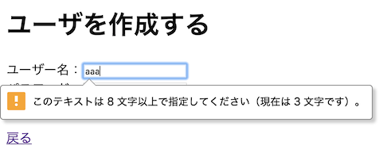

# データのバリデーションを設定する

入力フォームから送信できる情報を制限する

## バリデーションとは

入力フォームなどから送られたデータを処理するシステムの場合、データが適切なものかどうかは判断基準として重要である。

例えば、「パスワードは8文字以上」などのようにルールを定めたとき、8文字以下のパスワードが送信されたときには、全ての処理を行わず、どこかのチェック機構で処理を中断（もしくは例外処理）してしまうのが効率的である。

**ブラウザからのデータの送信前、もしくはデータの送信直後に適切かどうかをチェックし、適切でなければ処理を中断する仕組み**を<u>バリデーション</u>と呼ぶ。

### Apache Wicketでのバリデーション

Wicket でバリデーションを実現するには、

1. 送信データの適切さを判断し、適切でなければ処理を中断する
1. 処理を中断したことやその理由を画面に表示する

の二つが、コンポーネントやその設定項目（バリデータ）として準備されている。

### データの適切さの設定

例として、ユーザ作成画面のユーザ名とパスワードを、8文字以上32文字以下のみ適切なものとして設定する。

UserMakerPage.java の userNameField, userPassField のコンポーネントを次のように書き換える。

```java
// 匿名クラス化するので、右辺の型引数を <> から <String> に省略せずに書く
TextField<String> userNameField = new TextField<String>("userName", userNameModel) {
  // onInitialize() は全てのコンポーネントに備わっている、初期化時の処理。
  // オーバーライドするときは super.onInitialize() を忘れずに残しておく。
  @Override
  protected void onInitialize() {
    super.onInitialize();
    // 文字列の長さを8〜32文字に制限するバリデータ
    StringValidator validator = StringValidator.lengthBetween(8, 32);
    add(validator);
  }
};
userInfoForm.add(userNameField);
```

## 動作確認

WSBPApplciation を再起動し、 UserMakerPage を表示する。

ユーザ名を8文字以下の状態で、送信ボタンを押すと、エラーメッセージが表示される。



----

[目次へ](../../README.md) 