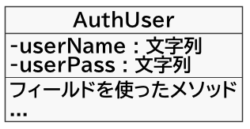

# 登録されているユーザの一覧を表示する 01

データベースを使うようなシステムでは、データの一覧を表示するような機能が良く必要になる。

- LINEの会話やTwitterのつぶやきのような、一覧のデータ
- Excelの様な表のデータ

が例としてあげられる。

こうしたデータをどのようにDBから取得するか、そしてWicket上にどうやって表示するかについて作成してみる。

## データベースのテーブル構造をJavaのクラス構造で表現

ここまでの課題で、auth_user テーブルをデータベースに作っていた。

**auth_userテーブル**<br>
| user_name | user_pass |
| ---- | ---- |
| b1992490 | qwertyui |
| b1992500 | asdfghjk |
| .... | .... |

このデータをJavaプログラム上で扱いやすくするには、テーブルと同じ構造のクラスがあるとよい。



### AuthUser.java の作成

`com.example.wsbp` パッケージの中に `data` パッケージを作成する。

ここに ValueObject となる AuthUser クラスを作成する。

```java
package com.example.wsbp.data;

import java.io.Serializable;

// AUTH_USER テーブルのデータを入れるクラス
// Wicketの Model に使うかもしれないクラスは、 implements Serializable をつける
public class AuthUser implements Serializable {

  private final String userName;  // auth_userテーブルのuser_name列のデータ
  private final String userPass;  // auth_userテーブルのuser_pass列のデータ

  public AuthUser(String userName, String userPass) {
    this.userName = userName;
    this.userPass = userPass;
  }

  public String getUserName() {
    return userName;
  }

  public String getUserPass() {
    return userPass;
  }

  @Override
  public boolean equals(Object o) {
    if (this == o) return true;
    if (o == null || getClass() != o.getClass()) return false;

    AuthUser authUser = (AuthUser) o;

    if (!userName.equals(authUser.userName)) return false;
    return userPass.equals(authUser.userPass);
  }

  @Override
  public int hashCode() {
    int result = userName.hashCode();
    result = 31 * result + userPass.hashCode();
    return result;
  }
}
```

- テーブルのフィールド名は、テーブルではスネークケース（単語の切れ目に `_` あり）だが、Javaではキャメルケース（ 単語の切れ目は大文字アルファベット）でよい（後述のBeanPropertyRowMapperについて、を参照）
- get は、フィールドのデータを参照する(or取得する）するためのメソッドで、 getterもしくは アクセッサ と呼ばれる。（アクセス修飾子と紛らわしいので、getter の方が良い）
- Wicketの Model に使う（or 使う可能性がある）クラスは `implements Serializable` をつける。<br>Serializable インターフェースは、「このインターフェースの実装クラスは、メモリ上のインスタンスの情報をそのままファイルに出力できるようにする」という、JVMへの命令のための特別なインターフェースである。

## テーブル構造を表現したクラスに検索データをセット

AuthUser.java のインスタンスに、auth_user テーブルの情報を検索して入れ込む。

これは、ユーザ認証の照合の部分の処理と同じように作成できる。

### IAuthUserRepository.java

検索したデータを AuthUser の List で返す機能を作成する。

```java
public interface IAuthUserRepository {

  //.中略

  /**
   * AuthUserテーブルのすべての情報を検索する
   *
   * @return レコードの内容を {@link AuthUser} の {@link List} で返す
   */  public List<AuthUser> find();

}
```

### AuthUserRepository.java

追加した Repository インターフェースの機能を実装する。

```java
@Repository
public class AuthUserRepository implements IAuthUserRepository {

  // 中略
  
  @Override
  public List<AuthUser> find() {
    // auth_user テーブルの user_name, user_pass を検索する
    String sql = "select user_name, user_pass from auth_user";

    // 検索用のSQLを実行する方法。
    // 取り出したいデータの型によって、第2引数の RowMapper を切り替える。
    // ? を使うSQLであれば、第3引数の Object型配列 の要素に順番に設定する。
    List<AuthUser> users = jdbc.query(sql,
            DataClassRowMapper.newInstance(AuthUser.class));

    // 取り出したデータ（Listの要素）をそのまま返値とする。
    return users;
  }

}
```

- **RowMapper** <br>データベースの検索結果を受け取るクラスの形を設定する。
    - **SingleColumnRowMapper**<br>データベースのテーブルから、1列だけのデータを検索するときに使う。引数には、データベースのデータを互換性のある列の型を指定する。<br>ユーザの認可部分では、`SingleColumnRowMapper<>(Boolean.class)` と書いていた。これはSQLのSELECT文の戻り値が `true` か `false`（もしくは何もない）になるように指定されていたため、Javaでこのデータを取り扱う `boolean（もしくはBoolean）` を指定している。
    - **DataClassRowMapper**<br>データベースのテーブルから、2列以上のデータを検索して、コンストラクタを使ってインスタンスにデータを入れ込むときに使う。引数には、データベースの構造と同じ構造のJavaクラスを指定する。<br>このRowMapperを使うと、 テーブルの `user_name` 列 ⇒ Javaクラスの `userName` フィールドというように、スネークケースとキャメルケースの変換も自動的に行ってくれる。
- JDBCTemplate の**queryメソッド**<br>データベースからの検索（SELECT）を行うSQLの実行時に用いる。検索は複数行のデータになる可能性があるので、List型の要素に各行の結果をつめて返す（要素の型は、RowMapperで指定した型）。もしSQLの実行結果が何も返さない場合は、要素が空になる。

### IUserService.java

Repository の機能を呼び出す Service 機能を作成する。

```java
public interface IUserService {

  // 中略
  
  /**
   * ユーザ名とパスワードの一覧を、AuthUser型のリストで検索する
   *
   * @return AuthUser型のListインスタンス
   */
  public List<AuthUser> findAuthUsers();
}
```

### UserService.java

追加した Service インターフェースの機能を実装する。

```java
  @Override
  public List<AuthUser> findAuthUsers() {
    var users = authUserRepos.find();
    System.out.println("データ件数：" + users.size());
    return users;
  }
```

----

[目次へ](../../README.md) 