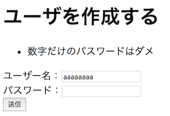

# 独自のバリデータ

## 独自のバリデータの作り方

独自のバリデータを作る方法はいろいろあるが、 Form#onsubmit でエラー（もしくは注意）メッセージを設定する方法がある。

このときの独自バリデーションによる処理の中断やその理由を表示するには、 FeedbackPanel コンポーネントを使う。

### HTML

例えば、FeedbackPanelのために、  form タグ内を書き換える。

```html
<form action="#" wicket:id="userInfo">
　 <!-- 独自のバリデーションを表示する -->
  <wicket:enclosure child="fbMsg">
    <div wicket:id="fbMsg">バリデーションの有無と理由</div>
  </wicket:enclosure>
  <div>ユーザー名：<input type="text" wicket:id="userName"/></div>
  ...
</form>
```

- `wicket:enclosure` は、子階層の fbMsg コンポーネントが表示されないようであれば、自身をHTML上から取り除く、特別なタグ。これが無くても動作するが、あった方が見栄えが綺麗になる場合が多い。 
- `<div wicket:id="feedbackmsg">......</div>`  には、form内のコンポーネントのバリデーションの有無と理由を自動的表示する。

### WebPageのサブクラス

次に、WebPageのサブクラスで、 FeedbackPanel コンポーネントを設定する。

```java
FeedbackPanel fbMsgPanel = new FeedbackPanel("fbMsg");
userInfoForm.add(fbMsgPanel);
```

### Form#onSubmit()

FormのonSubmitクラスで、バリデーションの処理を記述する。

例えば数値だけのパスワードを許したくない場合、

```java
Form<Void> userInfoForm = new Form<Void>("userInfo") {
  @Override
  protected void onSubmit() {
    String userName = userNameModel.getObject();
    String userPass = userPassModel.getObject();

    //(中略)

    Pattern p = Pattern.compile("^[0-9]*$");
    Matcher m = p.matcher(userPass);
    if(m.find()) {
      error("数字だけのパスワードはダメ");
      return;
    }

　　 //後略（正常な時の処理）

  }
};
```

- 正規表現（ `^[0-9]*$` ）で、文字列が数字だけかを検索する
- 数字だけのパスワードの時は、FeedbackPanel に「数字だけのパスワードはダメ」と表示して処理を中断（return)する。

### 動作例



なおこのメッセージにはHTLML上で ul/liタグとして生成され、 feedbackPanel > feedbackPanelERROR という class 属性が設定されるので、cssなどでデコレーションすることもできる。

----

[目次へ](../../README.md) 