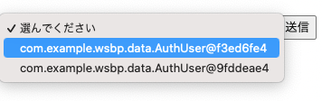

# 選択肢を選んで送信する（ドロップダウン） 01

複数のものから一つ（or複数）を選ぶ、という機能が必要にになることがよくある。

こうした機能をWicketでどのように実現するかについて、作成してみる。

## DropDownChoice コンポーネント

いわゆる **プルダウンメニューを作成するためには、 DropDownChoice コンポーネント** を使う。

### PullDownPage.html

`com.example.wsbp.page` パッケージに、 PullDownPage.html を作成する。

```html
<html xmlns:wicket="http://wicket.apache.org">
<head></head>
<body>
<h1>プルダウンメニューによる選択</h1>
<h2>このシステムに登録されているユーザ一の一覧</h2>

<form wicket:id="form">
  <select wicket:id="userSelection"></select>
  <button type="submit">送信</button>
</form>

</body>
</html>
```

### PullDownPage.java

```java
@MountPath("PullDown")
public class PullDownPage extends WebPage {

  @SpringBean
  private IUserService userService;

  public PullDownPage() {

    // プルダウンメニューに表示するためのリストのModelを作成
    // ここでは、LoadableDetachableModelを利用している。
    // このModelは、Pageの表示準備の開始から終了の間までデータをキャッシュし、表示準備の終了時にデータを破棄する。
    // DBから取得するデータは、大量になる場合がある。
    // そのような場合、LoadableDetachableModelを利用することで、データの取得とキャッシュ（使い回し）、最新化、メモリ節約の管理を自動化できる。
    var selectionModel = LoadableDetachableModel.of(() -> userService.findAuthUsers());
    // プルダウンメニューから選択したものを入れるためのModelを作成
    var selectedModel = new Model<AuthUser>();

    var form = new Form<>("form"){
      @Override
      protected void onSubmit() {
        // 選択肢の値が送信されたときの処理
        System.out.println(selectedModel.getObject().toString());
      }
    };
    add(form);

    // プルダウンメニューを作成するためのDropDownChoiceコンポーネント
    // 第1引数は wicket:id, 第2引数は選択したものを入れるためのModel, 第3引数は表示するためのリストのModel
    var userSelection = new DropDownChoice<>("userSelection", selectedModel, selectionModel);
    form.add(userSelection);

  }
}
```

起動し、`http://localhost:8080/PullDown` にアクセスすると、`インスタンス名@ハッシュコード` の形式で選択肢が表示される。

なお、ハッシュコードは、動作環境によってそれぞれ異なる。


</br>↓</br>

</br>↓</br>

　
この状態で、送信ボタンを押すと、選択したものと同じ `インスタンス名@ハッシュコード` が標準出力に表示される（つまり、ブラウザ上で選択されたものが、Wicket上に送信され、 Form#onSubmit の処理で標準出力されている）


ここで、選択肢に表示された `インスタンス名@ハッシュコード` はデータベースから取得された AuthUser のインスタンス名である。

このままではもちろん人間にとって分かりづらいので、次のセクションではインスタンス内のデータを使って選択肢を表示するように変更する。

----

[目次へ](../../README.md) 