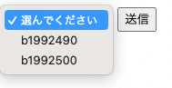
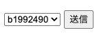

# 選択肢を選んで送信する（ドロップダウン） 02

## DropDownChoice コンポーネントに表示されるものを変更する

前ページで、 AuthUser のインスタンス名で表示されていた選択肢を、AuthUser の userName で表示するように変更する。

このためには、**表示変更用の ChoiceRenderer** を用意して使う。

### PullDownPage.java

前ページで作成したPullDownPageの中で、 DropDownChoice の直前（`add(form);` の直後あたり）で、 ChoiceRenderer を新たに追加して用意する。

```java
// 第1引数の文字列は、AuthUserのuserNameを選択肢の表示用として取り出すことを設定
var renderer = new ChoiceRenderer<>("userName");
```

この変数 rendererを、DropDownChoiceの第四引数として設定する。

**変更前**

```java
// プルダウンメニューを作成するためのDropDownChoiceコンポーネント
// 第1引数は wicket:id, 第2引数は選択したものを入れるためのModel, 第3引数は表示するためのリストのModel
var userSelection = new DropDownChoice<>("userSelection", selectedModel, selectionModel);
```

**変更後**

```java
// プルダウンメニューを作成するためのDropDownChoiceコンポーネント
// 第1引数は wicket:id, 第2引数は選択したものを入れるためのModel, 第3引数は表示するためのリストのModel, 第4引数は選択肢の表示用の設定
var userSelection = new DropDownChoice<>("userSelection", selectedModel, selectionModel, renderer);
```

起動し、`http://localhost:8080/PullDown` にアクセスすると、`インスタンス名@ハッシュコード` の形式で表示されていたAuthUserの選択肢が、それぞれのuserNameの値で表示されるようになる。


</br>↓</br>

</br>↓</br>



### ポイント

DropDownChoiceに渡す4つの引数の種類と順を覚えておくと、迷いづらい。

`(WicketId, 選んだもの用Model, 選択肢のリスト用Model, 選択肢に表示する値の設定);`

ただし、「選んだもの用Model」を省略する記述方法などもあるので、既存のコードを読む場合には注意する。

### 発展編

ChoiceRenderer は、表示名だけではなく、HTML上で選択肢を識別しているidを書き換えることもできる。

たとえば、

```java
public class UserReport {
  
  private long reportId;
  private String reportName;
  
  // 以下略
}
```

のようなクラスがあり、選択肢として表示するインスタンスのリストが 

- reportId:1012, reportName: "物理学"
- reportId:1025, reportName: "数学"
- reportId:1028, reportName: "英語"

のように用意されていたとする。

これを DropDownChoice で表示したいとなった時、

```java
var renderer = new ChoiceRenderer<>("reportName");
```

のようにChoiceRendererを用意すると、選択肢を表示する部分のHTMLは

```html
<option selected="selected" value="">選んでください</option>
<option value="0">物理学</option>
<option value="1">数学</option>
<option value="2">英語</option>
```

と生成される。一方で、

```java
var renderer = new ChoiceRenderer<>("reportName", "reportId");
```

のように第2引数を追加してChoiceRendererを用意すると、選択肢を表示する部分のHTMLは

```html
<option selected="selected" value="">選んでください</option>
<option value="1012">物理学</option>
<option value="1025">数学</option>
<option value="1028">英語</option>
```

と生成され、 `<option value=...` の部分も reportId を使うように変更できる。

選択肢に表示したいインスタンスに、固有のキーとなるidがあるような場合は、`value` も変更した方がわかりやすい場合がある。

----

[目次へ](../../README.md) 