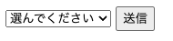
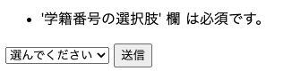

# 選択肢を選んで送信する（ドロップダウン） 04

## 送信ボタン時を押したときの挙動

DropDownChoiceで選んだものを次ページに渡す。この時、以下のような要望に対応しないといけない場合がある。

- 空欄の選択肢の送信を許可したくない
- 空欄の選択肢の送信を許可する

これも実現する方法がいくつかあるが、代表的な対処方法を例示する

### A.空欄の選択肢の送信を許可したくない

空欄の選択肢の送信を許可したくない場合は、[データのバリデーションを設定する](../D01/01.md)でも用いたバリデーションを使う。

**復習：** バリデーションは入力チェックのことで、入力チェックにパスしないと送信を許可しないという仕組み。

空欄の選択肢を許可しないバリデーションには、 `setRquied` というバリデーター用のメソッドを使う。

```java
var userSelection = new DropDownChoice<>("userSelection", selectedModel, selectionModel, renderer){
      @Override
      protected void onInitialize() {
        // このDropDownChoiceの初期化用の処理
        super.onInitialize();
        // 必ず空欄の選択肢を用意するように設定
        setNullValid(true);
        // 空欄の選択肢の送信を許可しないバリデーション
        setRequired(true);
        // エラーメッセージに表示する名前を設定
        setLabel(Model.of("学籍番号の選択肢"));
      }

（以下略）
```

`setRequired(true);` を設定することで、空欄（選択してください）のままでは送信ができなくなる。

また  **この時のエラーメッセージには、FeedbackPanel** を用いる。

#### PullDownPage.html

`<form>...</form>` の中に、以下のタグを追加する。

```html
<div wicket:id="feedback"></div>
```

#### PullDownPage.java

`FeedbackPanel` インスタンスを作成し利用する。

```java
var feedback = new FeedbackPanel("feedback");
form.add(feedback);
```

起動し、`http://localhost:8080/PullDown` にアクセスすると、空欄の選択肢のままではエラーが表示され、処理が進まない様になっている。


</br>↓</br>



### B.空欄の選択肢の送信を許可する

空欄の選択肢の送信を許可するときには、DropDownChoiceには特に設定は不要になる。

ただし、**送信された後のForm#onSubmitの処理で、`NullPointerException` が発生しないように** 気を付ける必要がある。

#### PullDownPage.java

例えば、FormのonSubmitメソッドで以下の様な処理を行う。

```java
    var form = new Form<>("form") {
      @Override
      protected void onSubmit() {
        // 次ページに渡すModelを用意する。
        // Wicketではさまざまな機能をもったModelを利用できるが、この機能が別ページで想定していない動きをすると動作不良の要因になる場合がある。
        // そのため、次ページにデータを渡す時には新しいModelに設定し直すことを心がけると、バグの防止になる。
        var sendingModel = new Model<>(selectedModel.getObject());
        if (Objects.isNull(sendingModel.getObject())) {
          // 選択肢が選ばれていない場合の処理
          // nullをそのまま渡すと、次ページでNullPointerExceptionが発生する要因になるので、ダミーのデータを渡す。
          var dummyData = new AuthUser("ユーザー名未設定", "パスワード未設定");
          sendingModel.setObject(dummyData);
        }
        // 次ページに渡すModelを使って、次ページ（ChoiceResultPage）を作成し移動する。
        setResponsePage(new ChoiceCompPage(sendingModel));
      }
    };
```

#### ChoiceResultPage.html, java

`com.example.wsbp.page` パッケージに、 ChoiceResultPage.html　と ChoiceResultPage.java を作成する。

```html
<html xmlns:wicket="http://wicket.apache.org">
<head></head>
<body>
<h1>選択されたものを表示</h1>

<p>あなたはユーザー名：<span wicket:id="userName"></span>, パスワード：<span wicket:id="userPass"></span>の選択肢を選びました。</p>

</body>
</html>
```

```java
@MountPath("ChoiceComp")
public class ChoiceCompPage extends WebPage {
  public ChoiceCompPage(IModel<AuthUser> model) {

    var choicedAuthUser = model.getObject();

    var userName = new Label("userName", Model.of(choicedAuthUser.getUserName()));
    add(userName);
    var userPass = new Label("userPass", Model.of(choicedAuthUser.getUserPass()));
    add(userPass);

  }
}
```

起動し、`http://localhost:8080/PullDown` にアクセスすると、選択した項目に応じて次ページで表示するものを変えることができるページが完成している。

----

[目次へ](../../README.md) 